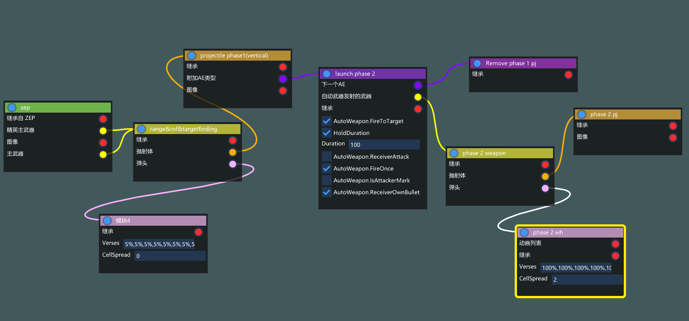
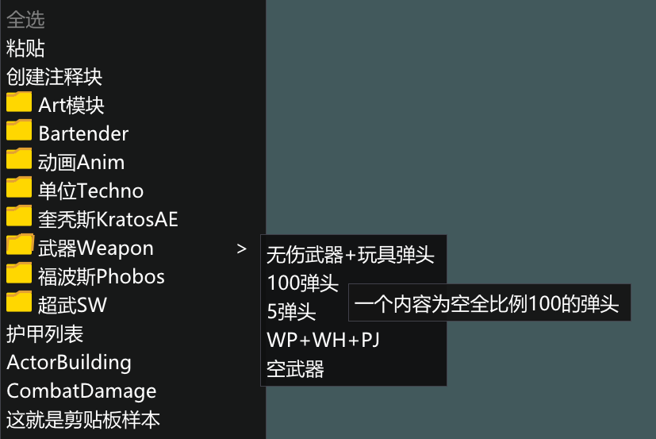
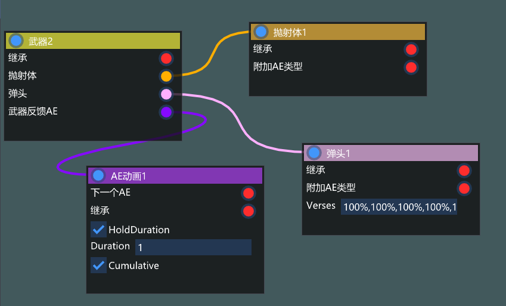
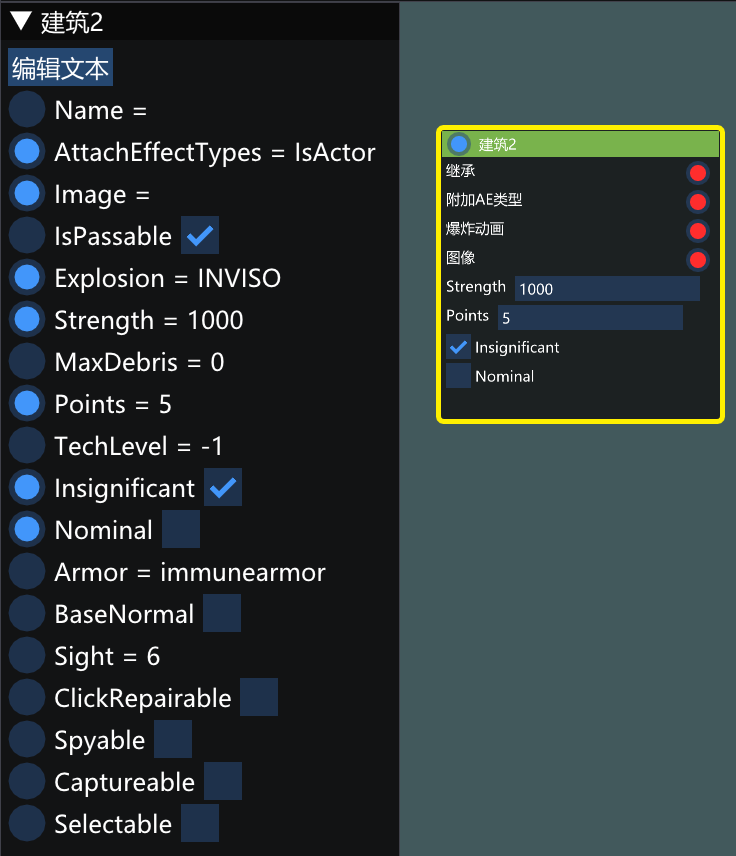
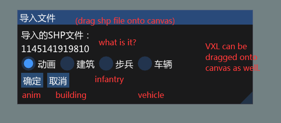
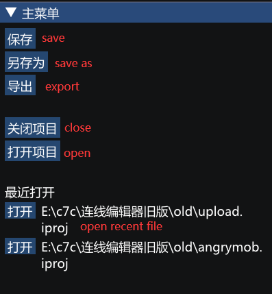
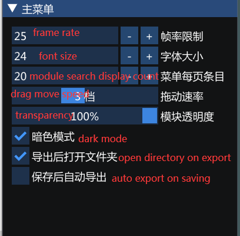
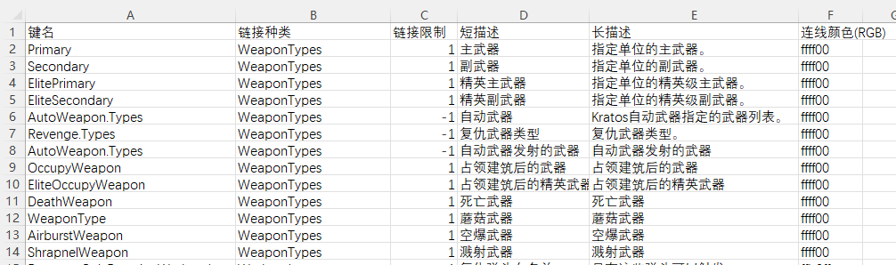
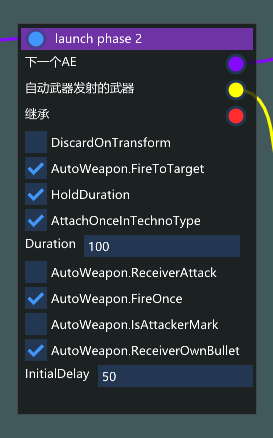
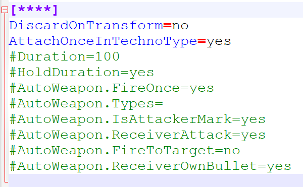

# INIBrowser
## What is This Tool

This is an advanced tool for advanced INI users. For so-called advanced users, they rarely need to verify basic INI flag meanings and syntax when writing INI files, having already established clear understanding of which flags to use for specific effects and which INI types to employ.

For advanced users, INI writing can generally be abstracted as: copying and pasting existing INI sections from vanilla files, making minor modifications, and then establishing connections.

During this process, users must repeatedly search in Rulesmd, copy-paste content, manually input new INI names, reference other INI sections using various flags, and finally perform registrations. In the Ares era, although creating copied units could be simplified through inheritance systems, the registration step remained unavoidable; modifying certain attributes still required searching for original flags within INI files.

These processes constitute the most labor-intensive aspects of INI editing. When dealing with complex INI content, the interconnections between modules become particularly troublesome - units link to weapons, weapons link to warheads, warheads link to particle systems, particle systems link to particles, particles link to graphics, graphics connect to trailers that link other animations. If INI arrangements are disorganized, users inevitably end up scrolling through multiple INI files, searching for various modules, frequently forgetting previous sections while viewing subsequent ones.

This editor resolves these tedious aspects, simplifying the INI writing process as much as possible.

```{note}
The tool aims to maximize flexibility, essentially functioning as a graphical notepad with connection capabilities. Beyond connection rules, the tool itself contains no built-in INI specifications and will not check for INI syntax errors.
```

## Module Library & Module Links
The editor uses canvas-based visual editing with modules. Left-drag to move canvas, click to select modules, right-drag to box-select modules, ctrl+c to copy, ctrl+v to paste.



The editor employs a module library system. This system can be understood as having numerous pre-copied modules stored in several file directories. Users simply need to drag these modules onto the canvas, which equates to copying existing INI blocks into ini files. While the editor provides many modules upon release, these cannot possibly cover all daily user requirements. Therefore, we encourage users to create custom module libraries, storing frequently used content in \Global\Modules for future convenience.

Besides manual module library creation, the system supports module generation from clipboard. Simply select a group of modules, press ctrl+c, then open the clipboard template provided by the editor and replace the content after Data=. Clipboard-created modules preserve positional relationships between modules, while manually created ones cannot.



When dragging modules onto the canvas, the system automatically replaces **** portions in prefabricated modules with randomized section names (which makes editor-generated INIs nearly unreadable unless manually renaming section names). Major categories requiring registration will automatically generate registration entries if declared in the category registry. If a flag needs to reference another module's name (e.g., a weapon specifying its projectile), simply connect the projectile's linkage point behind the corresponding flag.

Additionally, the tool supports reverse-linking with automatic flag creation: For instance, dragging a projectile module onto a weapon module will automatically connect via Projectile= flag. If the weapon module lacks this flag, the system will automatically generate it. For reverse-linking configuration details, refer to RegisterTypes.json documentation mentioned later.



Module labels like "Weapon2", "Projectile1", "Warhead1" displayed in the interface are ultimately comments. Press F1 to toggle display modes (showing real section names). By default, F2 renames module comments, while F3 modifies section names. Module categories currently cannot be modified. Right-clicking module headers opens a context menu for editing comment/section names, or copying existing modules (equivalent to ctrl+c). Ctrl+v creates duplicates.

```{note}
Inheritance currently appears as forcibly displayed linkage nodes on all modules. This may be relocated in future versions.
```



Click any module to enter edit mode. The toggle on the left side of flags controls whether to display them on the canvas. Numeric values can be directly edited on the canvas when displayed, or double-clicked in the left menu bar for edit mode. Boolean flags can be toggled directly on the canvas or in the edit interface.

Double-click the module's colored header or click the "Edit Text" button to enter free text mode, allowing Notepad-style editing of any content and modification of flags.

Drag-and-drop SHP/VXL files directly into the interface to automatically create modules with matching names. SHP requires selecting a type.



After editing, use the File menu: "Save" and "Save As" preserve project files, while "Export" generates directly includable INI files with automatic registration entries.

```{important}
Unconnected linkage nodes will be omitted from final output.
```



Additionally, the Settings menu enables "Auto-export after saving", allowing INI debugging by simply saving project files without manual export confirmation.



## Dictionaries and Categories
The editor includes built-in flag dictionaries and category registry tables located in the Global folder. TypeAlt.csv serves as the dictionary, while RegisterTypes.json defines the category registry.



```{hint}
To avoid the complexity of manually coding flag definitions, the dictionary system adopts a minimalistic approach:

only flags linking to other categories need to be defined in the dictionary.
- **LinkLimit: 1** restricts connections to one module, **-1** allows unlimited links to a category.
- Flags not in the dictionary derive their definitions from preconfigured module libraries.
```

For example:





- Flags with =yes or =no in preloaded modules are automatically classified as **boolean type** and can be toggled via checkboxes.
- Flags with predefined values are classified as **text type**.

```{note}
RegisterTypes.json declares all valid categories in the system. The "LinkCategory" field in the dictionary **must reference categories declared in** RegisterTypes.json. The JSON file includes detailed comments, allowing users to extend it with custom categories (e.g., for engine patches or mods).
```

## Other Settings
- \Resources\language.ini: Localization file for translating the editor interface.
- \Resources\config.json: Main configuration file for customizing shortcuts and settings (common hotkeys are predefined).
- Launch the editor with the -debugmenu parameter to enable debug menus.

## Planned Features
- **Flag-to-flag linking**: E.g., referencing ArmorTypes directly.
- **Flag bundle modules**: Linking to these modules will copy their sub-flags into the parent module.
- **Relocation of inheritance linkage points.**
- **Expanded module categories**: Support for AI, Sound, and other types.
- **INI file parsing**: Import and visualize entire INI files as connection diagrams.
