# Docs

## modules setting

Dictionary=`TypeAlt.csv`. You only need to put down flags that link to other types

All types are registered in `RegisterTypes`. You can add new types as you like

ImageModules are default modules when you drag in assets (SHP/VXL)

All other modules are stored in modules folder.

Module ini is easy to comprehend. Only one tip: any flag that has a `#` will not be folded. Links are not folded by default.

```{important}
YOU MUST MAKE YOUR OWN MODULE LIBRARY！！！！
```

## Hotkeys

|Key                        |Function
|:--------------------------|:------------------
|F2                         |Switch display mode
|Ctrl+S                     |save
|Ctrl+Shift+S               |save as
|Ctrl+O                     |open project
|Ctrl+E                     |export
|Ctrl+W                     |close project
|Ctrl+C                     |copy
|Ctrl+V                     |paste
|right click on canvas      |module library
|double click on canvas     |module search
|left click on module       |edit this module
|right click on module title|enter module menu
|double click on flag       |edit value

## Image demonstration

### right click for modules


### link modules

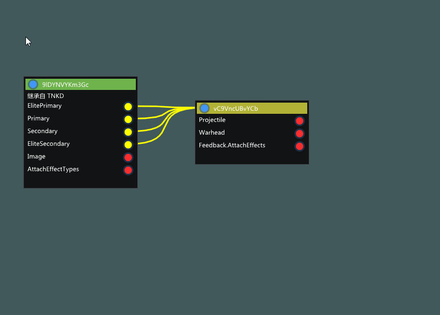

### reverse link

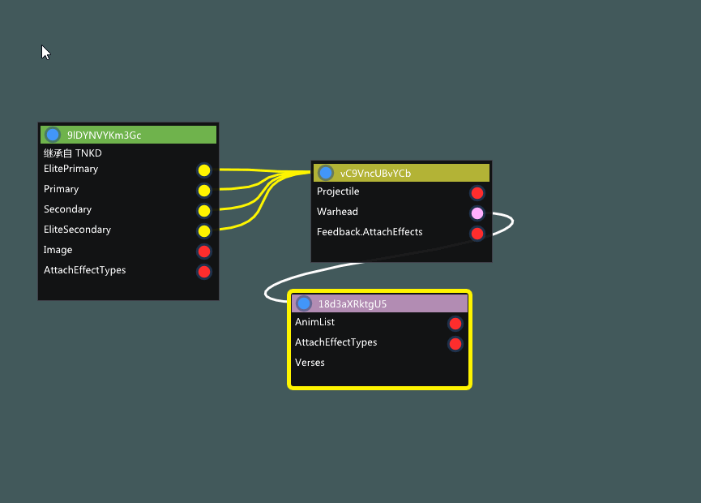

### fold flags

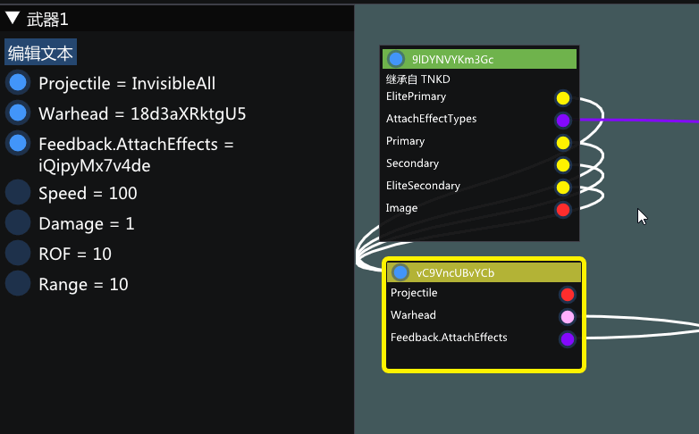

### text editor

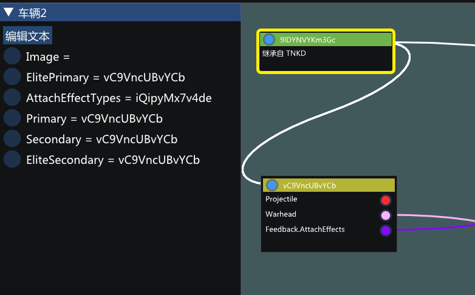

### directly edit bool

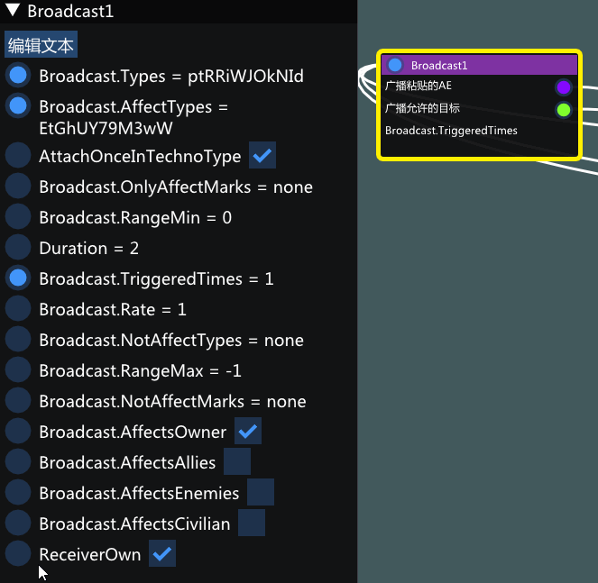

### directly edit value

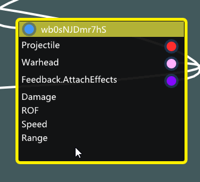

### import assets
- Shape/Voxel

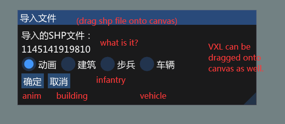

## Interface Overview

### main menu


### file menu

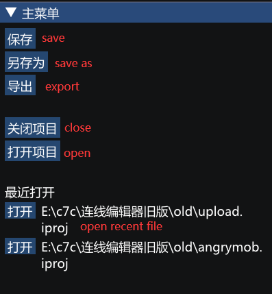

### navigate menu

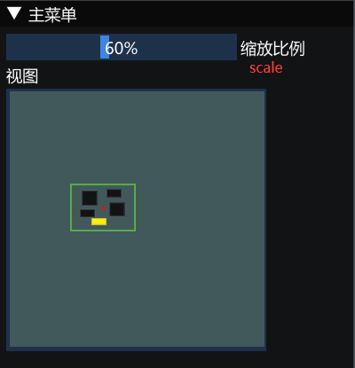

### list menu

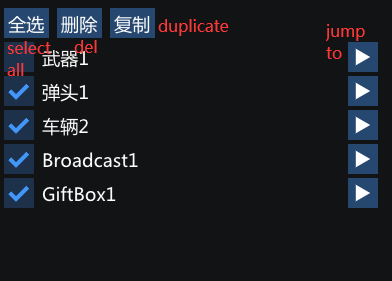

### options menu

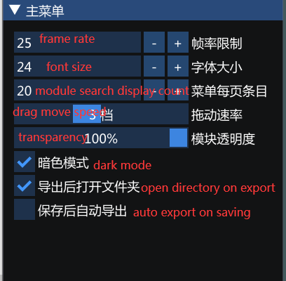

### right click menu

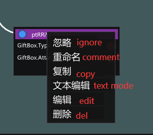
